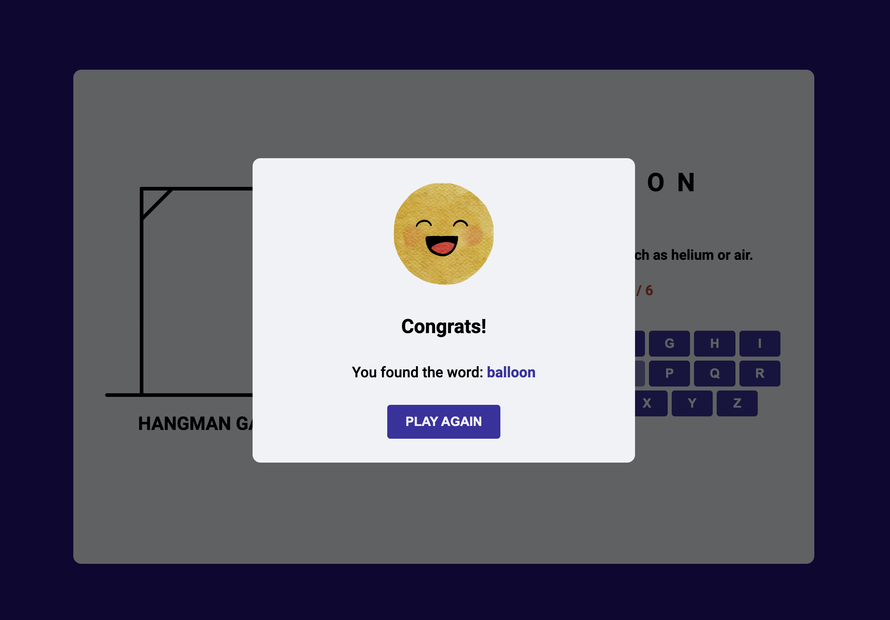

# Hangman Game

This Hangman game is a web-based application built to provide a classic word-guessing game experience. The design is customized, featuring a unique word list, vibrant images for lost and victory scenarios, and a color scheme designed with accessibility in mind.

## Table of Contents

- [Features](#features)
- [Usage](#usage)
- [Credits](#credits)
- [License](#license)
- [Questions](#questions)

## Features

- **Responsive UI:** Optimized for various screen sizes, ensuring a smooth gaming experience on both desktop and mobile devices.
- **Interactive Gameplay:** Users can guess letters, see their progress, and receive feedback on their guesses.
- **Custom Design:** Adjusted the design to my liking while following a tutorial by CodingNepal.

## Usage

1. **Start the Game:** The game begins with a random word hidden behind blank spaces.
2. **Guess Letters:** Click on the letters on the on-screen keyboard to guess the word.
3. **Track Your Progress:** Incorrect guesses will display on the screen and increment the hangman image.
4. **Win or Lose:** Guess all the letters correctly to win, or reach the maximum number of incorrect guesses to lose.

Play [here](https://adriannaderkacz.github.io/hangman-game/).

## Credits

- **Tutorial**: [CodingNepal](https://www.youtube.com/watch?v=hSSdc8vKP1I)
- **Images:** [Canva](https://www.canva.com/)
- **Color Scheme:** [Coolors](https://coolors.co/)
- **Words List:** [ChatGPT](https://chatgpt.com/)

## License

MIT License

Copyright (c) [2024] [Adrianna Derkacz]

Permission is hereby granted, free of charge, to any person obtaining a copy of this software and associated documentation files (the "Software"), to deal in the Software without restriction, including without limitation the rights to use, copy, modify, merge, publish, distribute, sublicense, and/or sell copies of the Software, and to permit persons to whom the Software is furnished to do so, subject to the following conditions:

The above copyright notice and this permission notice shall be included in all copies or substantial portions of the Software.

THE SOFTWARE IS PROVIDED "AS IS", WITHOUT WARRANTY OF ANY KIND, EXPRESS OR IMPLIED, INCLUDING BUT NOT LIMITED TO THE WARRANTIES OF MERCHANTABILITY, FITNESS FOR A PARTICULAR PURPOSE AND NONINFRINGEMENT. IN NO EVENT SHALL THE AUTHORS OR COPYRIGHT HOLDERS BE LIABLE FOR ANY CLAIM, DAMAGES OR OTHER LIABILITY, WHETHER IN AN ACTION OF CONTRACT, TORT OR OTHERWISE, ARISING FROM, OUT OF OR IN CONNECTION WITH THE SOFTWARE OR THE USE OR OTHER DEALINGS IN THE SOFTWARE.

## Questions

For questions, please contact me at a.derkacz@gmail.com.
GitHub: [adriannaderkacz](https://github.com/adriannaderkacz).